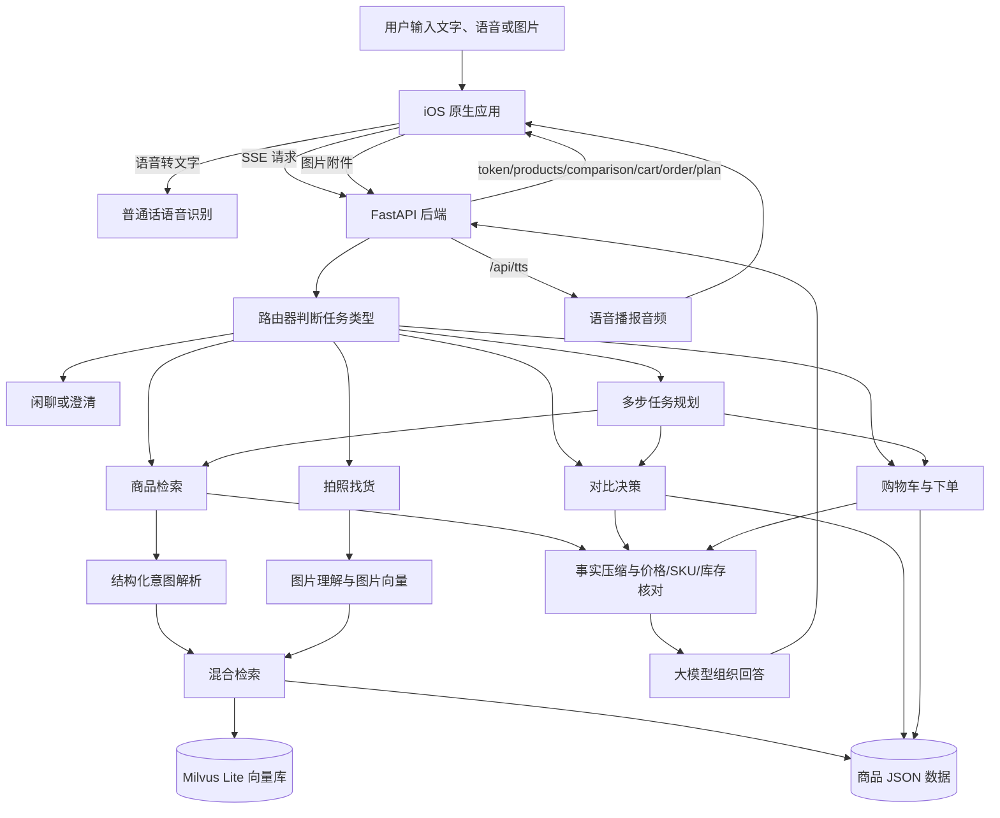
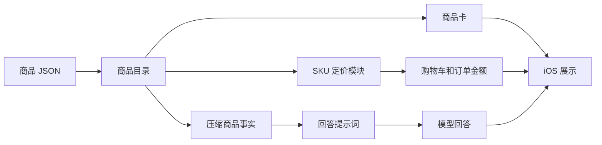
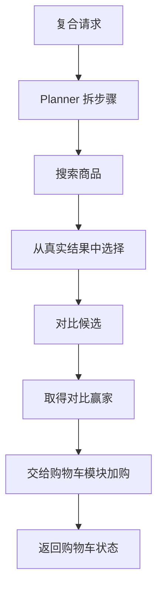

# 系统架构与技术设计

这份文档说明系统如何从用户输入走到商品推荐、对比、加购和下单。它面向评审和后续维护者，重点放在模块边界、数据流、配置和关键工程决策。

## 一句话架构

系统采用“原生 iOS 客户端 + FastAPI 后端 + Milvus 向量库 + 大模型理解意图”的结构。模型负责理解用户表达和生成自然语言，后端负责检索、核对商品事实、维护购物车和订单状态。价格、规格、库存和订单号都来自结构化数据，不由模型自由生成。

## 端到端流程图

如果需要在飞书里使用可视化图片，可以打开 `docs/diagrams/SystemArchitecture.drawio` 导出 PNG 或 SVG。下面的 Mermaid 图用于仓库内阅读和维护。



## 技术栈

| 层级 | 选型 | 作用 |
| --- | --- | --- |
| 客户端 | SwiftUI、Swift Concurrency | 原生 iOS 页面、流式状态更新、商品卡片、详情页、收藏、动效反馈和订单卡。 |
| 语音输入 | Apple Speech、AVFoundation | 普通话语音识别，识别结果进入同一套聊天链路。 |
| 语音播报 | 后端 Gemini TTS + iOS AVFoundation 兜底 | 优先请求 `/api/tts` 生成音频；失败时使用系统语音播报。 |
| 后端框架 | FastAPI、Pydantic | 接口、SSE 流式输出、请求和响应结构校验。 |
| 向量库 | Milvus Lite | 存储商品文本块和图片块向量。 |
| 向量模型 | `doubao-embedding-vision-251215` | 文本和图片共用同一多模态向量空间。 |
| 对话模型 | OpenAI 兼容聊天接口 | 意图识别、路由、回答生成、对比维度提取。 |
| 数据 | JSON 商品库 | 标题、品牌、类目、SKU 价格、描述、问答、评价、图片路径。 |
| 测试 | pytest、Swift Test | 后端单元/黑箱测试和 iOS 流程测试。 |

## 目录结构

```text
.
├── client/ios/
│   ├── EcommerceGuide/              # Swift Package，放核心 UI、服务、模型和测试
│   └── EcommerceGuideApp/           # Xcode Host App，用于 Simulator 和真机运行
├── docs/                            # 提交说明、运行手册、架构和模块文档
├── ecommerce_agent_dataset/         # 商品数据和商品图片
├── ingestion/                       # 商品切块、embedding、Milvus 入库
├── server/                          # FastAPI 后端和业务模块
├── tests/                           # 后端测试
├── ingest.py                        # 重建向量库入口
├── requirements.txt                 # Python 依赖
└── README.md                        # 项目入口说明
```

## 后端模块边界

| 模块 | 主要职责 |
| --- | --- |
| `server/app.py` | FastAPI 入口、SSE 输出、静态图片、TTS 接口、缓存入口。 |
| `server/config.py` | 环境变量和运行配置。 |
| `server/catalog.py` | 加载商品 JSON，整理类目、品牌、SKU、库存和商品事实。 |
| `server/intent.py` | 意图解析、路由分类、图片意图解析和规则兜底。 |
| `server/retrieval.py` | 向量检索、关键词检索、融合排序和过滤。 |
| `server/assistant.py` | 主编排层，连接路由、检索、对比、购物车、Planner 和回答生成。 |
| `server/comparison/` | 多商品解析、对比维度、证据检查和赢家判断。 |
| `server/commerce.py` | 加购、删改数量、地址、结算、确认订单和库存扣减。 |
| `server/planner.py` | 复合请求拆解成白名单步骤。 |
| `server/pricing.py` | SKU 定价和购物车金额计算。 |
| `server/tts.py` | Gemini 语音播报音频生成。 |

## 客户端模块边界

| 模块 | 主要职责 |
| --- | --- |
| `EcommerceGuideHostApp.swift` | Xcode 应用入口，根据环境变量选择 SSE 或 mock 服务。 |
| `ShoppingConciergeRootView.swift` | 首屏、聊天、拍照找货、订单页之间的页面流转。 |
| `ChatViewModel.swift` | 管理消息流、商品卡、商品骨架屏、购物车、订单、计划状态、语音输入和语音播报。 |
| `SSEChatService.swift` | 连接后端流式接口，解析 `token/products/comparison/cart/order/plan/done` 事件。 |
| `TextToSpeechService.swift` | 请求后端 TTS、缓存音频、失败时用系统语音播报。 |
| `MandarinSpeechRecognitionService.swift` | 调用系统普通话语音识别。 |
| `ProductCarouselView.swift` | 商品卡片展示、详情入口、收藏、加购和滑动快捷操作。 |
| `ProductDetailSheet.swift` / `ProductMediaPager.swift` | 展示商品主图、推荐理由、规格、评分和月销，支持图片缩放。 |
| `FavouritesStore.swift` / `FavouritesSheetView.swift` | 本地持久化收藏，提供收藏列表、详情入口、加购和滑动移除。 |
| `ProductCardsSkeleton.swift` | 商品卡加载骨架屏，避免等待期间出现空白内容。 |
| `CartFlightOverlay.swift` | 加购时播放商品缩略图飞入购物车入口的动效。 |
| `GuideMotion.swift` / `Shimmer.swift` / `SwipeActions.swift` | 统一按钮按压、入场、骨架屏和滑动操作等前端交互动效。 |
| `PlanStatusView.swift` | 多步任务状态展示，支持等待、执行中、完成和失败。 |
| `OrderCardView.swift` | 待确认订单、地址编辑、确认和取消。 |

## 后端接口

| 接口 | 方法 | 用途 |
| --- | --- | --- |
| `/health` | `GET` | 存活探测。 |
| `/api/chat` | `POST` | 一次性返回完整回答，适合测试和调试。 |
| `/api/chat/stream` | `POST` | SSE 流式聊天，iOS 主要使用。 |
| `/api/v1/chat/stream` | `POST` | 兼容旧客户端的 SSE 路径。 |
| `/api/products/{product_id}` | `GET` | 获取商品原始详情。 |
| `/assets/products/...` | `GET` | 商品图片静态资源。 |
| `/api/tts` | `POST` | 输入文本，返回 `audio/wav` 语音播报音频。 |

## SSE 事件结构

| 事件 | 何时发送 | 客户端表现 |
| --- | --- | --- |
| `token` | 开场白和正文生成时 | 逐字追加到聊天气泡。 |
| `products` | 推荐结果可用时 | 展示商品卡片轮播。 |
| `comparison` | 对比结果可用时 | 展示结构化对比卡。 |
| `cart` | 购物车变化时 | 更新购物车和绿色状态条。 |
| `order` | 订单草稿、提交或取消时 | 展示订单卡，支持改地址和确认。 |
| `plan` | 多步任务开始、每步状态变化时 | 展示浅灰色计划卡和步骤进度。 |
| `done` | 一轮结束时 | 停止 loading，触发语音播报。 |

## 配置表

| 配置 | 默认值 | 说明 |
| --- | --- | --- |
| `CHAT_API_KEY` / `ARK_CHAT_API_KEY` | 空 | 对话模型密钥。 |
| `CHAT_BASE_URL` / `ARK_CHAT_BASE_URL` | Gemini OpenAI 兼容地址 | 对话模型接口。 |
| `CHAT_MODEL` / `ARK_CHAT_MODEL` | `gemini-3.1-flash-lite` | 对话模型名称。 |
| `ARK_EMBEDDING_API_KEY` | 空 | 豆包向量模型密钥。 |
| `ARK_EMBEDDING_BASE_URL` | 火山 Ark 地址 | 向量接口。 |
| `ARK_EMBEDDING_MODEL` | `doubao-embedding-vision-251215` | 向量模型名称。 |
| `ENABLE_VECTOR_SEARCH` | `true` | 是否启用向量检索。 |
| `ENABLE_LLM` | `true` | 是否启用模型回答。 |
| `ENABLE_LLM_INTENT` | `true` | 是否启用模型意图识别和路由。 |
| `ENABLE_QUERY_CACHE` | `true` | 是否启用原文查询缓存。 |
| `ENABLE_FILTER_CACHE` | `true` | 是否启用结构化条件缓存。 |
| `ENABLE_TTS` | `true` | 是否启用 `/api/tts`。 |
| `TTS_API_KEY` / `GEMINI_API_KEY` | 空 | 语音播报模型密钥。 |
| `TTS_MODEL` | `gemini-3.1-flash-tts-preview` | 语音播报模型。 |
| `TTS_VOICE` | `Sulafat` | 语音音色。 |
| `ECOMMERCE_GUIDE_BACKEND_URL` | scheme 内配置 | iOS 连接的 SSE 地址。 |
| `ECOMMERCE_GUIDE_SERVICE` | 空 | iOS 默认走 SSE；设为 `mock` 才用本地 mock。 |
| `ECOMMERCE_GUIDE_TTS_URL` | 按后端地址推导 | iOS 语音播报接口地址。 |

## 关键设计一：事实安全

系统不把模型当作商品数据库。商品标题、品牌、SKU、价格、库存和订单金额都来自后端结构化数据。模型只能在这些事实上组织回答。这样可以避免把 15g 体验装价格写成 50g 正装价格、编造库存、编造优惠券或推荐库外商品。

事实安全链路如下：



## 关键设计二：混合检索

向量检索负责理解语义，关键词检索负责守住明确词面。两路结果用排名融合，而不是把不同分数硬加。价格、品牌、类目是硬过滤；卖点和规格通常作为软偏好参与排序。

## 关键设计三：多智能体编排

用户的请求先由路由器分到不同能力。单步请求直接执行对应模块；复合请求由 Planner 拆成白名单步骤，再复用已有模块。Planner 不自己编商品、价格或赢家，只调度搜索、选择、对比、加购和结算。



## 关键设计四：低延迟体验

后端会先发送开场白，再并行做路由、向量预热和检索。多步任务会先发送完整计划，再实时更新步骤状态。客户端在等待商品卡时展示骨架屏，避免用户看到空白气泡。可缓存的无上下文推荐会命中查询缓存或结构化条件缓存；涉及购物车、对比、图片、多轮上下文的请求不缓存，避免答错。

## 关键设计五：降级容错

| 故障 | 降级方式 |
| --- | --- |
| 向量接口或 Milvus 不可用 | 退回关键词检索，并在响应中标记 warning。 |
| 对话模型不可用 | 用确定性回答拼出基于真实商品的结果。 |
| 意图模型不可用 | 用规则解析和关键词路由。 |
| TTS 不可用 | `/api/tts` 返回 503，iOS 降级到系统语音。 |
| SSE 处理中途失败 | 补一条兜底文案并发送 `done`，避免客户端一直转圈。 |
| 用户开启减少动态效果 | iOS 关闭或弱化飞入购物车、彩带和 shimmer 等装饰性动效。 |

## 当前边界

- 库存来自演示用的确定性合成值，不是真实仓储系统。
- 下单是模拟闭环，不接真实支付和物流。
- 向量库默认随仓库数据一起使用，只有商品数据变化时才需要重建。
- 语音播报依赖 Gemini TTS 密钥；没有密钥时 iOS 仍可使用系统语音播报。
