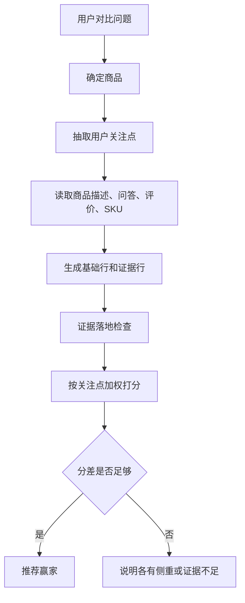

# 对比决策

这份讲怎么回答「第一个和第二个哪个更保湿」「这两双跑鞋哪个穿一天不累」「哪个更便宜」这类对比。难点不在文笔，而在**有理有据**：要比的是真实商品，按用户真正在意的点比，证据不够时不硬判输赢。

## 大致怎么走

1. 先弄清楚**要比哪几个商品**。
2. 让模型从问题里读出**用户在意哪些点**（保湿？降噪？还是就比价格）。
3. 后端拿这些点去商品的真实文案里找证据、打分。
4. 综合各点选出更优的；要是证据不足或太接近，就不硬判，如实说「各有侧重」。

模型只负责「听懂在比什么」，事实判断全在后端——这样模型不会凭印象瞎说哪个好。

## 先确定比哪几个

来源有好几种，按优先级：前端直接传的对比商品、用户话里直接出现的商品 id、「第一个和第二个」这种序号、商品名、以及最近展示过的前两个。一次最多比 3 个。如果只能确定一个、或没有上下文，就反问让用户补充。

## 怎么打分

每次对比先固定出三行基础信息——基础定位、价格与 SKU、规格明细——再加上几行「证据行」，每行对应用户在意的一个点（最多 4 个）。

证据行是这样判的：模型当裁判，读每个商品的标题、规格、描述、问答、评价，给出这一行谁赢、为什么、有多大把握。但有一道**关卡**：模型引用的那句话必须真的能在商品文案里找到，找不到就把把握度压低，绝不让它给商品安一个查无实据的优点。模型不可用时，退回一套确定性打分（按关键词命中和通用褒贬语气）。另外，一行要赢得够明显才算数：最高分得是正的，而且比第二名高出一截，否则这一行就不分胜负。

**最后选总冠军**不是看某一行，而是把各行的赢家按权重加起来：

- 用户**明确点名**要比的点，权重最高（它才是用户真正关心的，哪怕后端又补了别的点，也不能盖过它）。
- 后端**主动补**的质量点，权重中等（比价格模式下会压到 0，见下）。
- 价格行：只在「就是比价格」时才计分，平时不参与定胜负。
- 那三行基础信息只展示，不参与定胜负。

加完如果最高分还是不够（证据太少或太接近），就不硬判，返回「没有绝对赢家，各有侧重」。

## 「就是比价格」这种

当用户主要在比价格（说了「哪个便宜」或「便宜优先」），进入价格主导模式：把价格这一行提到最前面，确保它不会被「最多 4 个点」截掉（否则四个质量点会把价格挤出去，反而判不出谁便宜）；价格行计分，质量点全压到 0——用户问的是价格，不是这些。

价格的措辞一定落到**具体哪个 SKU**，比如「薇诺娜 15g 体验装（89 元）」，绝不把 15g 的价格安到 50g 的标题上去。

## 查无实据时如实说

用户明确问了某个点，但商品库里压根没有相关信息（比如拿两件 T 恤问「哪个更防水」），不会被偷偷丢掉，而是在结论前补一句「商品库里没有关于防水的明确信息」，免得拿别的点硬判。

> **技术细节**：实现在 `server/comparison/`。商品解析按优先级走，上限 3 个、聚焦点上限 4 个。证据行由 `_llm_judge` 判定，grounding 关卡是「引用必须出现在该商品文案里」，否则降置信度；不可用时退回确定性打分。行内赢家需 `> 0` 且领先第二名 `>= 2`。跨行加权：点名 `5.0`，自动补的质量点 `2.0`（价格主导时 `0`），价格行价格主导时 `1.5`、否则 `0`，基础行 `0`；总分 `<= 0` 不判赢家。价格措辞取 `selected_price_sku` 或 `lowest_price_sku`。

## 对比流程图

## 对比行类型

| 行类型 | 是否参与最终胜负 | 说明 |
| --- | --- | --- |
| 基础定位 | 否 | 展示品牌、类目、核心定位。 |
| 价格与 SKU | 只在价格主导时参与 | 必须落到具体规格，例如 15g 体验装或 50g 正装。 |
| 规格明细 | 否 | 帮用户看清容量、颜色、尺码、套餐等。 |
| 用户点名关注点 | 是，权重最高 | 例如“更保湿”“更降噪”“更适合日常跑步”。 |
| 系统补充质量点 | 是，权重较低 | 只作为辅助，不盖过用户明确需求。 |

## 价格事实安全

价格对比不会只看商品标题上的规格，而是优先使用用户指定 SKU 或商品最低价 SKU。多规格商品会明确写出“哪一个规格是多少钱”。例如某款面霜有 `15g 体验装 89 元` 和 `50g 正装 268 元`，系统不能写成“50g，售价 89 元”。如果用户问“哪个更便宜”，结论也必须基于同一口径的具体 SKU。

## 几个能复现的例子

- 推荐保湿护肤品（便宜优先）后问「第一个和第二个哪个更便宜」→ 选出更便宜的那款，措辞落到具体 SKU 价格。
- 推荐两双缓震跑鞋后问「穿一天哪个不累」→ 两双都有强缓震证据、不相上下时，不硬判。
- 推荐两款降噪耳机后问「哪个更安静、戴久了也舒服」→ 综合降噪和佩戴两点选出更优的，理由来自用户评价。

> **技术细节**：黑箱测试在 `tests/test_comparison_evaluation.py`，只过 `/api/chat`，用假模型模拟点的抽取，后端仍按真实商品打分。
