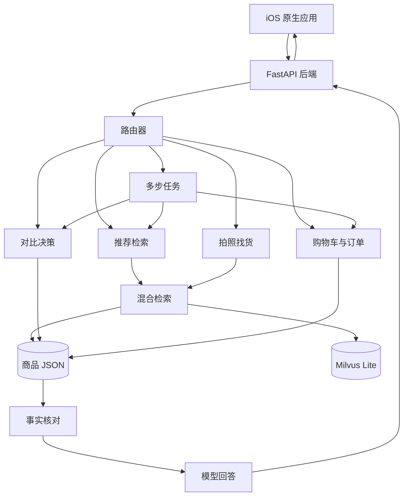
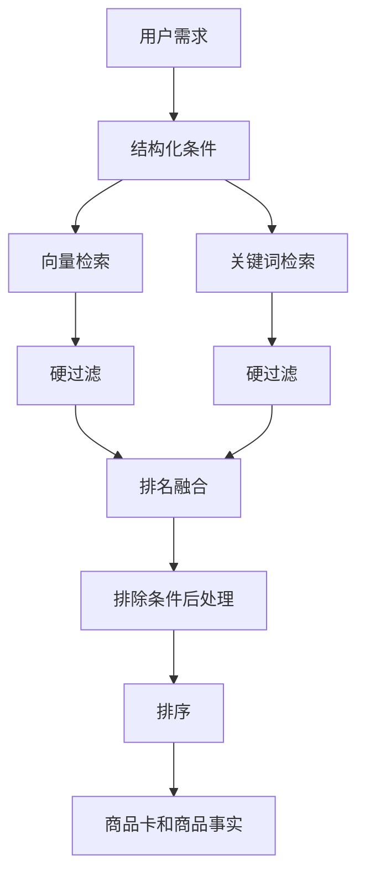
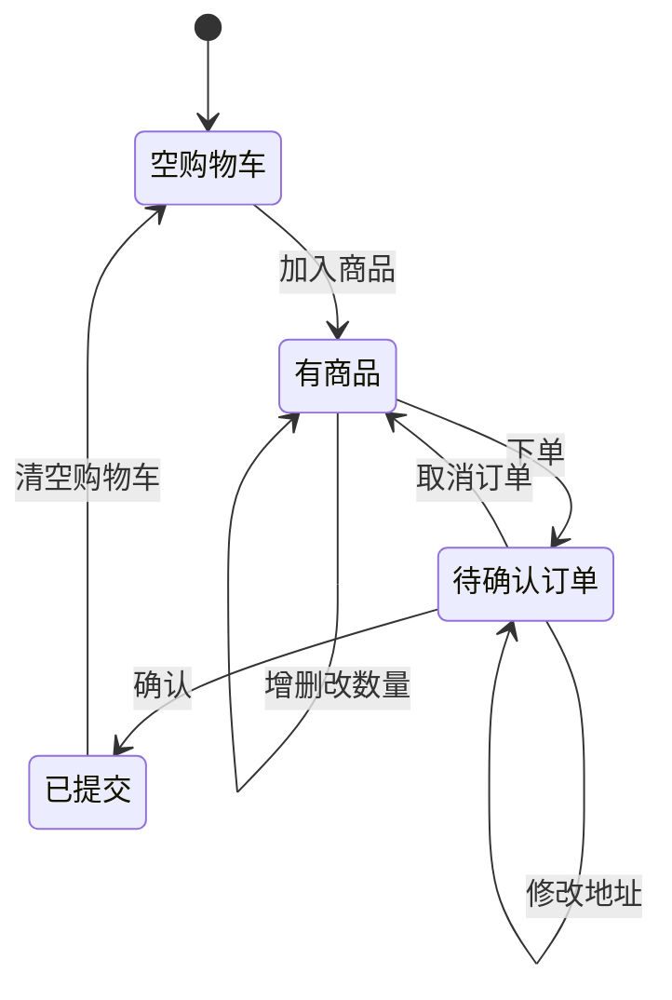

# 设计文档

## 设计目标

该系统要解决的是电商导购中的“用户说不清、商品信息复杂、模型容易编造事实”的问题。用户可以用自然语言、语音或图片提出需求，系统需要在真实商品库中找到合适商品，并能完成推荐、筛选、对比、加购和下单闭环。

设计上采用一条原则：**模型负责理解用户表达，代码负责核对事实和执行状态。** 这样既保留大模型对口语和复杂需求的理解能力，又避免价格、SKU、库存和订单金额出错。

## 总体架构

架构图 draw.io 源文件：`docs/diagrams/SystemArchitecture.drawio`。复制到飞书时建议导出为 PNG 或 SVG 后插入。

| 层级 | 设计 |
| --- | --- |
| 客户端 | SwiftUI 原生应用，负责流式聊天、商品卡、详情页、收藏、拍照、语音输入、语音播报、购物车和订单确认。 |
| 后端 | FastAPI 服务，负责路由、检索、事实核对、智能体编排、SSE 输出和 TTS。 |
| 数据层 | 商品 JSON + Milvus Lite。JSON 是事实源，Milvus 负责语义召回。 |
| 模型层 | 对话模型用于意图、路由和回答；豆包多模态 embedding 用于文字和图片检索；Gemini TTS 用于语音播报。 |

## 数据与检索设计

商品库包含四个大类的一百余个商品：美妆护肤、数码电子、服饰运动、食品饮料。每个商品包含标题、品牌、类目、SKU 价格、营销描述、官方问答、用户评价和主图路径。

系统不会把完整 JSON 直接交给模型，而是先生成可控的“商品事实”。价格、SKU 和库存字段完整保留，描述、问答和评价会压缩成短摘要，减少提示词长度和模型误读空间。

检索流程 draw.io 源文件：`docs/diagrams/CoreFlows.drawio`。

| 设计点 | 说明 |
| --- | --- |
| 切块策略 | 按概要、官方问答、用户评价、商品图片切块，不按固定字数硬切。 |
| 向量检索 | 使用多模态 embedding，支持文字和图片在同一向量空间中检索。 |
| 关键词检索 | 对标题、品牌、类目、描述、问答、评价做加权匹配。 |
| 融合排序 | 用排名融合合并两路结果，避免直接相加不同分布的分数。 |
| 硬过滤 | 价格、类目、品牌必须真实满足条件。 |
| 软偏好 | 卖点、规格、场景通常影响排序，不轻易把候选全部过滤掉。 |
| 排除约束 | 检索后再判断“不要含酒精”等否定条件，避免把否定词当正向需求。 |

## 意图和路由设计

路由器先判断用户这一轮要做什么，再分发给不同模块。它只接收压缩过的上下文信号，例如上一轮路线、是否有购物车、是否有展示商品、是否有待确认订单、是否刚做过对比。这样可以减少提示词长度，也能避免把完整历史塞给模型造成不稳定。

| 路由 | 典型输入 | 处理模块 |
| --- | --- | --- |
| 推荐检索 | “推荐适合油皮的洗面奶” | 意图解析 + 混合检索。 |
| 主动澄清 | “推荐一款手机” | 先问预算、拍照、续航等方向。 |
| 对比决策 | “第一个和第二个哪个更便宜” | 对比模块。 |
| 购物车操作 | “把第一个加入购物车” | 购物车模块。 |
| 下单确认 | “下单”“确认” | 订单模块。 |
| 多步任务 | “推荐跑鞋，对比最便宜的两双，并加入购物车” | Planner。 |
| 闲聊 | “你好”“谢谢” | 不检索商品。 |

模型不可用时，系统会退回关键词路由和规则解析。模型正常工作时，代码只做合法性校验和兜底，不随意覆盖模型的正确判断。

## 多智能体编排

系统把推荐、对比、购物车、订单和多步任务拆成独立模块。每个模块只负责自己的确定性边界，避免一个模块既理解需求又改购物车又生成订单，导致状态不可控。

| 模块 | 职责 |
| --- | --- |
| 推荐检索模块 | 解析需求、检索商品、压缩事实、生成推荐回答。 |
| 对比决策模块 | 确定商品、抽取关注维度、找证据、打分、输出建议。 |
| 购物车模块 | 加购、删除、改数量、清空、SKU 定价和库存限制。 |
| 订单模块 | 生成草稿、修改地址、确认、取消和模拟提交。 |
| Planner | 把复合请求拆成搜索、选择、对比、加购、结算等白名单步骤。 |

Planner 不直接生成商品或价格，只负责拆步骤和调度。每一步复用已有模块，因此复合任务和单步执行保持一致。

## 事实安全设计

电商导购最不能接受的是事实错误。系统从设计上把高风险字段从模型手里拿出来：

| 风险字段 | 事实来源 |
| --- | --- |
| 商品标题 | 商品 JSON。 |
| 品牌和类目 | 商品 JSON 和加载时的规范化索引。 |
| SKU 和价格 | SKU 字段和 `pricing.py`。 |
| 购物车金额 | 后端按单价和数量计算。 |
| 库存 | 后端会话库存台账。 |
| 订单号 | 后端提交订单时生成。 |
| 对比证据 | 商品描述、官方问答和用户评价。 |

例如某款面霜有 `15g 体验装 89 元` 和 `50g 正装 268 元`，系统必须明确写出具体规格，不能把 15g 价格套到 50g 标题上。用户问“哪个更便宜”时，结论也必须基于同一口径的 SKU 价格。

## 购物车与订单设计

购物车模块支持自然语言 CRUD，订单采用“两步确认”：

用户说“下单”时只生成待确认订单；用户确认后才提交、生成订单号并清空购物车。如果用户在确认前改了购物车，系统会重新生成草稿，避免提交过期订单。

## 客户端体验设计

iOS 客户端的第一屏是可用产品体验，而不是说明页。用户进入后可以直接对话、看商品卡、打开详情、收藏商品、拍照找货、语音输入、听语音播报和确认订单。

| 客户端能力 | 设计说明 |
| --- | --- |
| 流式聊天 | 逐字显示模型回答，同时插入商品卡、对比卡、计划卡和订单卡。 |
| 商品卡片 | 展示标题、品牌、类目、价格、图片、评分/月销和推荐理由，支持打开详情、收藏、加购和滑动快捷操作。 |
| 商品详情 | 通过分页展示主图、推荐理由、规格和销售信息，图片支持缩放。 |
| 本地收藏 | 收藏商品持久化到端侧，收藏页支持打开详情、加购和滑动移除。 |
| 商品骨架屏 | 后端计划返回商品卡时先显示 shimmer 骨架，避免对话流出现空白等待。 |
| 计划进度 | 多步任务先显示完整计划，再实时更新 pending、running、done、failed。 |
| 购物车状态 | 后端返回 cart 事件后更新本地购物车和状态条；端侧加购会播放商品飞入购物车动效。 |
| 订单确认 | 订单卡和订单确认页都可编辑收货信息，确认或取消通过快捷回复发送给后端。 |
| 订单成功反馈 | 提交成功后展示订单成功页和一次性庆祝动效。 |
| 拍照找货 | 支持相机和相册；Simulator 用相册，真机可拍照。 |
| 语音输入 | 使用系统普通话语音识别，识别文本进入同一套 RAG 流程。 |
| 语音播报 | 优先后端 TTS，失败时系统语音兜底；同一文本会缓存音频。 |
| 可访问性 | 装饰性动效尊重系统“减少动态效果”，必要时降级为淡入或关闭。 |

## 性能和降级设计

| 目标 | 设计 |
| --- | --- |
| 首屏快 | SSE 先发开场白，路由和向量预热并行。 |
| 商品等待明确 | 客户端用骨架屏展示商品加载状态，计划步骤先于执行结果出现。 |
| 成本可控 | 无上下文推荐支持查询缓存和结构化条件缓存。 |
| 上下文安全 | 涉及多轮、购物车、对比、图片和 Planner 的请求不缓存。 |
| 向量失败可用 | 退回关键词检索。 |
| 模型失败可用 | 用确定性回答返回真实商品。 |
| TTS 失败可用 | iOS 退回系统语音。 |

## 设计边界

- 库存是演示用合成库存，不连接真实仓储。
- 下单是模拟订单，不连接真实支付和物流。
- 商品库规模是一百余个商品，重点验证工程链路和事实安全。
- 语音播报依赖 TTS 密钥；没有密钥时系统语音兜底。
