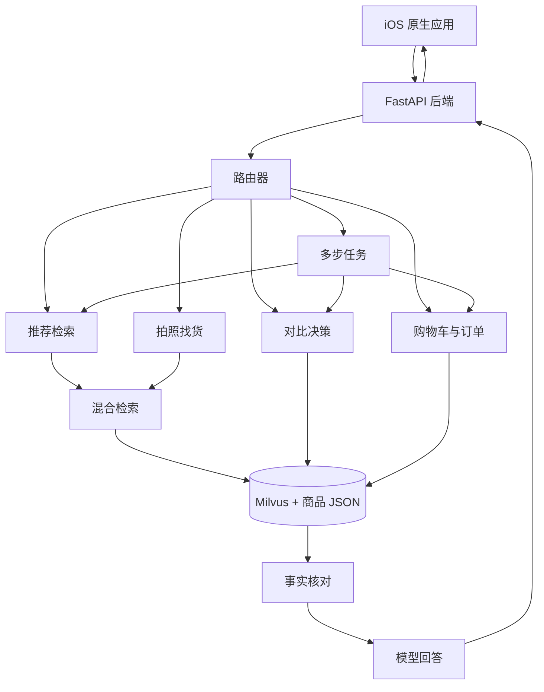

# 系统总览

一句话：这是一个电商导购系统。用户用大白话、语音或图片表达需求，系统听懂后去商品库里找，再像真人导购一样推荐、对比、加购、下单。

整套系统守一条规矩：**让大模型负责「听懂人话」，让代码负责「核对事实和兜底」。** 模型读懂用户想要什么，但价格、库存、订单号这些不能出错的东西，一律由代码从结构化数据里取，不让模型自己编。万一模型挂了，代码还能降级把基本功能撑住，不至于整个崩掉。

## 一轮对话会经历什么

```text
用户输入文字、语音或图片
   │
   ▼
iOS 客户端发起流式请求
   │
   ▼
后端先回一句开场白（用户立刻看到回应）
   │
   ▼
路由器判断这句话想干嘛
   │
   ├─▶ 打招呼 / 闲聊        →  直接回一句
   │
   ├─▶ 太宽泛（只说品类）    →  先反问一句，缩小范围
   │
   ├─▶ 找商品              →  解析需求 → 检索 → 回答 + 商品卡
   │
   ├─▶ 对比                →  确定商品 → 按证据打分 → 给出建议
   │
   ├─▶ 购物车 / 下单        →  加购 / 改数量 / 结算 / 确认
   │
   ├─▶ 拍照找货            →  图片理解 → 图片向量检索 → 相似商品
   │
   └─▶ 一句话要做好几件事    →  拆成多步，依次调用上面的能力

   最后回答和操作都只基于真实数据，绝不编价格、库存、参数。
```

## 系统架构图



## 每一类怎么处理

- **打招呼 / 闲聊**：直接回一句友好的话，不去硬推商品。
- **太宽泛**（「推荐一款手机」，只说了品类、什么条件都没给）：先反问一句（预算多少？拍照还是续航？），等用户补充再推荐，而不是瞎猜着推一堆。
- **找商品**：把口语（「适合油皮的便宜洗面奶」）解析成结构化条件，两路一起检索找出最相关的几个，回答只基于真实商品事实。
- **对比**：先弄清楚要比哪几个商品，再按用户在意的点打分，证据不够就不硬判输赢，如实说「各有侧重」。
- **购物车 / 下单**：加购、改数量、结算、确认、改收货地址，金额和库存都来自真实数据，不是模型说了算。
- **商品详情和收藏**：用户可以打开商品详情、查看图片和规格说明，也可以把商品收藏到本地收藏页，后续继续对比或加购。
- **一句话多步**（「推荐跑鞋并把最便宜的加入购物车」）：拆成几个小步，依次调用上面这些能力，每步都用真实结果喂给下一步。
- **拍照和语音**：拍照找货会把图片转成可检索的语义；语音输入只改变输入方式，识别后的文字仍走同一套导购链路；回答完成后可以语音播报。

## 想深入看哪一块

| 你想了解 | 看这份 |
| --- | --- |
| 提交文档入口 | [`Submission.md`](Submission.md) |
| 项目文档 | [`ProjectDocument.md`](ProjectDocument.md) |
| 设计文档 | [`DesignDocument.md`](DesignDocument.md) |
| 说明文档 | [`UsageDocument.md`](UsageDocument.md) |
| 如何部署和体验 | [`Runbook.md`](Runbook.md) |
| 系统架构细节 | [`Architecture.md`](Architecture.md) |
| 测试文案和预期结果 | [`EvaluationCases.md`](EvaluationCases.md) |
| 商品数据怎么存、怎么被找出来 | [`RetrievalAndData.md`](RetrievalAndData.md) |
| 怎么听懂意图、决定走哪条路、回答怎么不跑偏 | [`IntentAndRouting.md`](IntentAndRouting.md) |
| 接口、流式输出、缓存、出错怎么兜 | [`BackendService.md`](BackendService.md) |
| 购物车与下单 | [`CartCheckoutAgent.md`](CartCheckoutAgent.md) |
| 对比决策 | [`ComparisonDecisionAgent.md`](ComparisonDecisionAgent.md) |
| 多步任务 | [`PlannerAgent.md`](PlannerAgent.md) |
| iOS 原生体验 | [`ios-ui-design.md`](ios-ui-design.md) |
