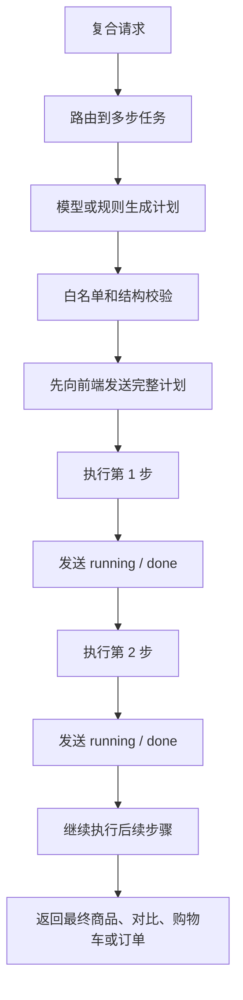

# 多步任务

这份讲怎么处理一句话里要连着做好几件事的需求，比如：

> 帮我推荐跑鞋，对比最便宜的两双哪个更便宜，把更便宜的加入购物车。

## 为什么要单独有它

平时一句话只走一条路：要么搜索、要么对比、要么加购。可上面这种复合句，会被某个模块半路抢走——购物车一看到「加入购物车」就直接执行了，把前面的推荐和对比全跳过。多步任务模块就是把这种复合句**拆成一串能一步步执行的小任务**，再挨个调用现有的能力完成。

## 怎么拆、怎么保证不乱来

和全局规矩一致：**模型负责拆，代码负责验。** 模型把复合句拆成一串步骤（搜索 → 选出最便宜的两个 → 对比 → 把赢家加购），但它只能用白名单里的动作和参数，后端先校验再执行：

- 越界的参数拉回合法值（不认识的排序方式归到「按相关度」，不认识的加购目标归到「上一步的结果」），不认识的动作整步丢掉。
- 整个计划还要结构合理才放行：至少两步、搜索不能出现多次、要加购就得有个能拿到商品的来源步骤（搜索 / 选择 / 对比）。不合格就退回一套确定性的兜底拆法。
- 模型不可用时，直接用确定性兜底，常见的复合链路照样能拆。

**单步的需求不会被它抢走。** 「把第一个加到购物车」还是走购物车模块，不会被硬拆成计划。

> **技术细节**：拆解在 `server/planner.py`。白名单动作 `product_search` / `select_products` / `comparison` / `cart_action` / `checkout` / `ask_clarification`；校验是 `_coerce_step`（纠偏 / 丢弃）+ `_valid_plan`（结构检查）；判定为多步由路由器决定（`force=True` 调用），关键词兜底里才用 `looks_like_planned_task` 前置判断。

## 每一步怎么执行

关键点：每一步都**复用现有模块**，不另起炉灶，所以商品、价格、对比赢家、购物车金额全都和单独用那些功能时一模一样。

- **搜索**这一步，走的就是正常的「听懂意图 + 检索」。要是这一步发现用户想要的东西本店根本不卖（比如「手表」），整个计划就**中止**，回一句「本店暂不提供」，而不是硬把最接近的商品塞进购物车。
- **选择**这一步，在上一步真实返回的商品里按价格挑（最便宜 / 最贵），不让模型自己写商品 id 或编价格。
- **对比**这一步，把选出来的真实商品交给对比模块，赢家由对比模块定。
- **加购**这一步，拿确定好的真实商品 id 交给购物车模块执行。用户在搜索里点过的规格（「512GB 高配版」）会一路带到这里，让加购的那行按这个规格定价，和直接加购完全一致。

执行时每一步都实时往前端发进度，用户能看着步骤一个个完成，而不是干等到最后才出结果。

> **技术细节**：调度在 `server/assistant.py`；搜索复用 `IntentParser` + `ProductRetriever`，对比复用 `ComparisonService`，加购复用 `CommerceService.apply_candidate`；逐步进度由 `_prepare_planned_task_updates` 发出。

## 计划执行流程图

## 支持的步骤

| 步骤 | 作用 | 事实来源 |
| --- | --- | --- |
| `product_search` | 搜索商品 | 正常意图解析和检索链路。 |
| `select_products` | 从上一步结果中选择低价、高价、评分或相关商品 | 上一步真实商品卡。 |
| `comparison` | 对比候选商品 | 对比模块和真实商品事实。 |
| `cart_action` | 把选中商品加入购物车 | 购物车模块和 SKU 定价。 |
| `checkout` | 生成待确认订单 | 当前购物车和订单状态。 |
| `ask_clarification` | 缺关键信息时反问 | 路由器或 Planner 的澄清结果。 |

## 前端状态展示

计划一生成，后端就会先发送 `plan` 事件，前端以浅灰色展示所有步骤。执行过程中，每一步依次变成 `running`，完成后变成 `done` 并显示摘要；失败时变成 `failed`，后续步骤不会盲目继续。这样用户能先看到系统准备做什么，再看到每一步结果。

## 几个例子

- 「推荐跑鞋，并把最便宜的一双加入购物车」→ 搜跑鞋 → 选最便宜 → 加购，购物车里是真实那一款。
- 「推荐跑鞋，对比最便宜的两双，把更便宜的加入购物车」→ 搜 → 选两款 → 对比 → 加购赢家，加购的 id 等于对比赢家。
- 「找一款蓝牙耳机，加入购物车并结算」→ 搜 → 选 → 加购 → 出待确认订单，金额和购物车一致。
- 「把第一个加到购物车」（单步）→ 不走多步，直接走购物车模块。
- 「推荐一块手表并加入购物车」（不卖手表）→ 计划中止，回「本店暂不提供」，购物车不动。

> **技术细节**：黑箱测试在 `tests/test_planner_flow.py`，覆盖复合加购、对比加购赢家、单步不被接管、SSE 先发计划帧、以及假模型也必须按真实商品执行。往后可加：更多动作、更细的澄清反问、把执行轨迹存进会话方便用户追问「刚才为什么选这个」。
