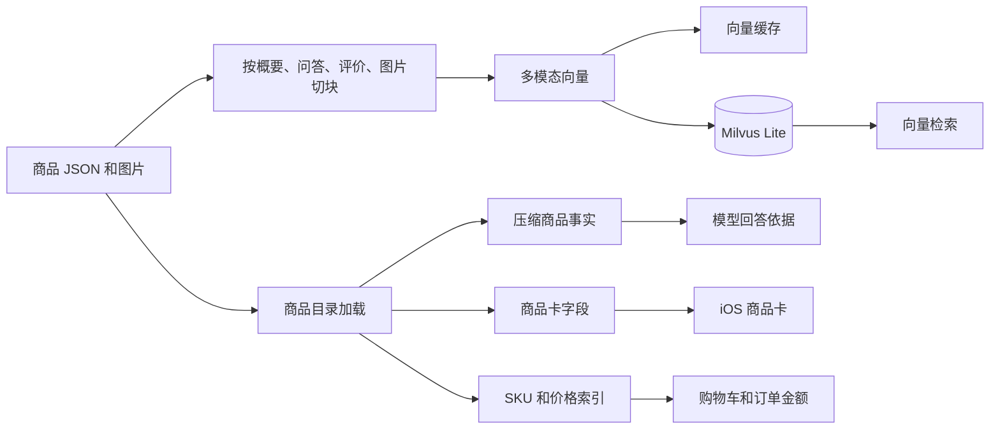
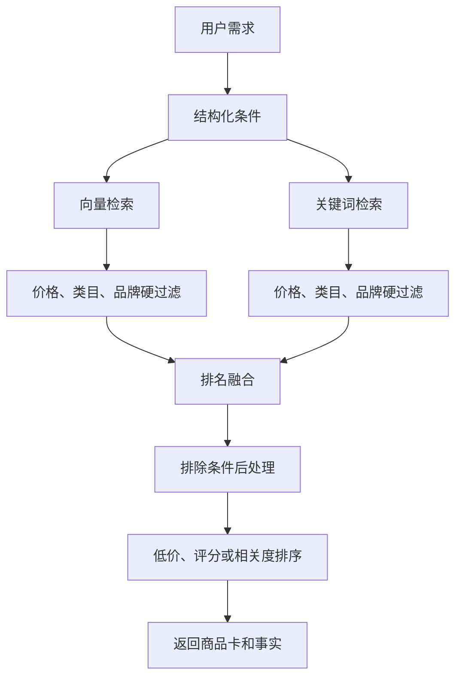

# 数据与检索

这份讲商品数据是怎么存的，以及用户问一句话之后，系统怎么从一百个商品里找出最相关的几个。听懂意图、决定怎么回答在 [`IntentAndRouting.md`](IntentAndRouting.md)，接口和缓存在 [`BackendService.md`](BackendService.md)。

## 商品库里有什么

商品就是一堆 JSON 文件，四个大类（美妆护肤、数码电子、服饰运动、食品饮料）一共一百来个。每个商品有标题、品牌、类目、若干规格（SKU，各自带价格），还有一段营销描述、官方问答和用户评价。

系统启动时把这些 JSON 读进来，整理成几样东西：所有类目、子类目、品牌的清单（给「听懂意图」那一步用），一个能按条件筛商品、算最低价的索引，前端要显示的商品卡，以及交给模型当作答依据的「商品事实」。

这里有个细节：**模型不会拿到完整的原始 JSON**，只拿裁剪过的事实字段。一是减少干扰，二是少给它编造的空间。为了让回答的第一个字更快出来，这份事实还会进一步压缩——重复的价格说明只在系统提示里写一次，描述、问答、评价各留几条短摘要，但价格和 SKU 一个不删（回答全靠它们才不跑偏）。压下来，一次回答的提示词大概能减一半。

> **技术细节**
> - 入口 `ProductCatalog.load()`，读 `ecommerce_agent_dataset/*/data/*.json`。
> - 交给模型的事实由 `product_facts()` 生成（裁剪 + 压缩）。
> - 库存是启动时按 `product_id` 合成播种的，不是真实仓储，详见 [`CartCheckoutAgent.md`](CartCheckoutAgent.md) 的「库存」节。

## 数据流图

## 入库前先把商品切成小块

要让商品能被「按意思」搜到，得先把它切成一块块可检索的小单元，再分别转成向量。我们不是按固定字数硬切，而是**按内容的自然边界切**，每块都是一个能独立看懂的单元：

- 一块概要（标题 + 类目 + 卖点 + 营销描述拼起来）
- 每条官方问答各一块
- 每条用户评价各一块（带评分）
- 商品主图一块

这样切，召回和精确度都更好：用户问保湿，能命中评价里聊保湿的那块；问某个功能，能命中问答里那块。检索完再按商品去重，同一个商品只留最匹配的那一块，不会让一个商品刷屏。

> **技术细节**：切块在 `ingestion/chunk.py`；每块 id 形如 `{product_id}::{suffix}`，入库后回到 `product_id` 去重。

| 块类型 | 内容 | 适合解决的问题 |
| --- | --- | --- |
| 概要块 | 标题、类目、卖点、营销描述 | 用户说大致需求或场景时召回商品。 |
| 问答块 | 官方问答 | 用户问参数、规格、适用人群时召回证据。 |
| 评价块 | 用户评价和评分 | 用户问舒适、保湿、口感等体验时召回证据。 |
| 图片块 | 商品主图 | 用户上传图片找同款或相似商品时召回。 |

## 怎么变成向量、存在哪

「变成一串数字」这步叫 embedding，用的是豆包的多模态模型。它一个模型同时管两件事：入库时给文字和图片块算向量，用户提问时给问题（或上传的图片）算向量。**关键是这两边必须用同一个模型**，否则两边的数字对不上，按意思搜就失灵了。

向量存在 Milvus 里（一个向量数据库）。这个库是团队事先生成好的，平时只读不重建，除非确实要重新入库才会跑一遍。

另外有一层缓存：算过的向量会按内容存到磁盘上，下次遇到一模一样的文字或图片直接取，不再花钱调接口。入库和线上服务共用这一份缓存。

> **技术细节**
> - embedding 在 `ingestion/embed.py`，Milvus 封装在 `ingestion/milvus_store.py`，模型 `doubao-embedding-vision-251215`，向量 2048 维。
> - collection 叫 `products`，主键 `chunk_id`，相似度用 `COSINE`，索引 `AUTOINDEX`。
> - 缓存 `ingestion/cache.py`，按内容的 SHA-256 当 key，启动时整盘读进内存，多线程读写加了锁。
> - 默认不重建 `data/milvus.db`，要重建才跑 `ingest.py`。

## 怎么把商品找出来（检索）

用户问一句话，系统会用两种方式同时去找，再把两边的结果汇到一起。

一种是**看意思**：把用户的话和每个商品都转成向量，意思越接近，数字就越接近。这样哪怕用户说的是「冬天穿的厚外套」，也能找到「羽绒服」，字面上一个字对不上也没关系。（用户传了图片就走「拍照找同款」，用图片的向量当查询，其余流程一样。）

另一种是**看字面**：按词去对，看商品的标题、品牌、类目、描述、问答、评价里有没有用户提到的词。命中标题或品牌的，比评价里偶然蹦出一个字重要得多。

两种各有各的毛病：看意思的有时会想多，找回来的东西沾点边但不对路；看字面的又太死，用户换个说法它就找不着了。两种搭着用，正好互相补位。

真正麻烦的是怎么把两边合起来。它们给的分根本不是一回事：一个是「像不像」的小数，一个是「中了几个词」的个数，硬凑在一起只会乱。所以我们干脆不看分，只看排名：在任意一种方式里排得越靠前，给的分越多，越往后给得越少。这样一来，两边都靠前的商品加起来分自然最高，就排到了最前面。一个商品两种方式都找到，就标成「两种都命中」。

价格、类目、品牌这类**硬条件**是真过滤（不在预算内的直接拿掉），而卖点、规格这类**软偏好**只影响排序、不一棍子打死。最后如果用户明确说了「要最便宜的」或「评分最高的」，再整体重排一次。

还有「排除」——比如「不要含酒精的」。这个不在检索阶段过滤，而是检索完之后让模型在候选里判断哪个该剔掉；模型不可用时，退回一套确定性规则（只在商品自己的文案里正面提到这个词、且不是「不含酒精」这种否定说法，才剔）。

> **技术细节**
> - 检索在 `server/retrieval.py`。向量路：`embed_text(query)`（或改写后的查询）→ Milvus 取 top-K → 按 product 去重 → 套 `SearchFilters` 硬过滤；图片路走 `embed_image`。
> - 关键词路：在 title / brand / category / 描述 / 问答 / 评价上匹配，类目、品牌、标题权重更高。
> - 融合：RRF，每路贡献 `1/(RRF_K+rank)`（`RRF_K=60`），按名次非原始分；两路命中相加，`source=hybrid`，同分偏低价。
> - 价格 / 评分重排在 `ShoppingAssistant._order_hits`，只在没有 `required_terms` / `requested_specs` 时触发。
> - 排除词的确定性兜底是 `catalog.violates_excluded`。
> - `retrieval_source` 四种取值：`vector` / `lexical` / `hybrid` / `none`。

## 检索流程图

## 不能出错的数据

有些东西错了就是事故，所以一律从结构化字段取，不让模型碰：

- **价格和 SKU**：商品卡和购物车里的价格，永远来自商品的 SKU 字段，不从模型写的文案里抠。用户点名了某个规格（「512GB 高配版」），就解析到对应的真实 SKU 再定价，对不上才回退到默认 / 最低价那档。
- **品牌写法统一**：数据集里同一家公司有两种写法（Nike / 耐克、苹果 / Apple 苹果），加载时统一并成一个名字，免得品牌清单、筛选、商品卡三处对不上，把一个牌子拆成两个。
- **库存**：数据集本身没有库存，这块是合成出来的——但它的台账、加购时的拦截、下单后的扣减都是真的，详见 [`CartCheckoutAgent.md`](CartCheckoutAgent.md) 的「库存」节。

> **技术细节**：SKU 解析 `catalog.sku_id_for_phrase`；品牌统一 `BRAND_ALIASES`（在 `catalog.load` 应用）；价格链路 catalog → `ProductCard`/SKU → `pricing.py`。
